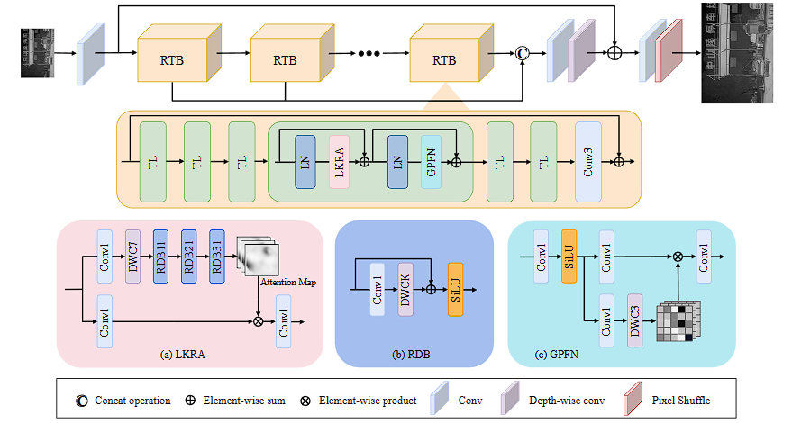

# LKFormer

We present a novel Transformer network, called LKFormer, to solve infrared image SR. Specifically, we design a large kernel residual attention structure to replace the vanilla SA layer to achieve local and non-local feature modeling. In addition, the proposed module can process high-resolution infrared images more efficiently and does not exhibit a quadratic increase in computational complexity with increasing image resolution. Furthermore, to enhance the suitability of the proposed Transformer architecture for the task of dense pixel prediction, we develop a novel module, named the GPFN. The GPFN module improves the information flow within the network by incorporating pixel attention branching. The link to the paper is at [LKFormer: large kernel transformer for infrared image super-resolution | Multimedia Tools and Applications (springer.com)](https://link.springer.com/article/10.1007/s11042-024-18409-3).

## 1. Environment

* Please prepare an environment with python=3.8, and then use the pyTorch.

## 2. Train

- First configure the parameters under the option file and then run the main_train_SR file.

## 3. Dataset

We use public datasets.

Donwload link is available at  https://figshare.com/s/2121562561211c0a8101 .